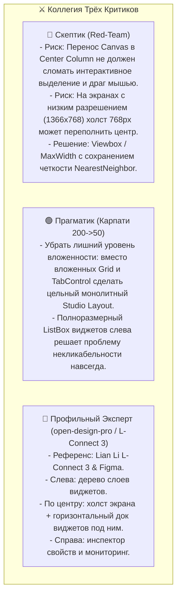
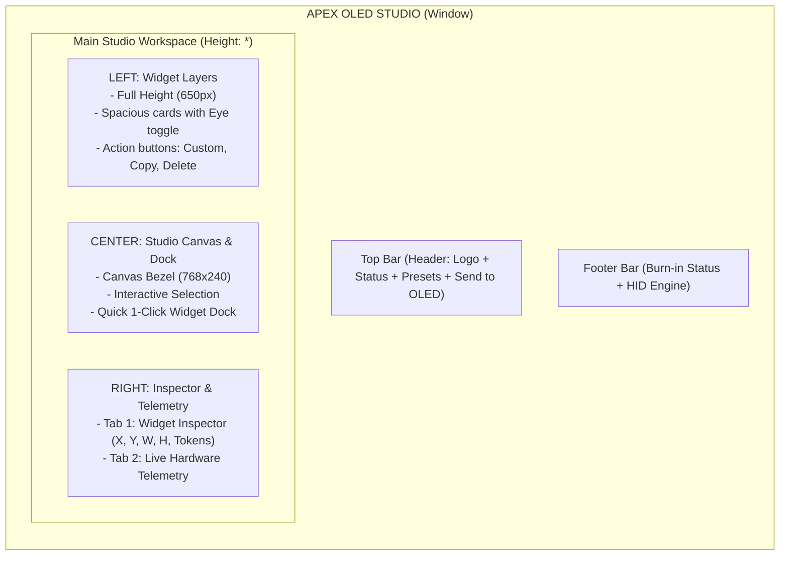

# Studio Redesign: Pro 3-Column Workspace (Figma & L-Connect 3 Architecture)

## Problem Identified from User Screenshot & Feedback
1. **Critical Usability Blocker ("виджеты поменять не возможно у тебя кнопки закрывают место с выбором виджетов")**:
   - The root window grid had 4 stacked rows:
     - Row 0: Top Bar
     - Row 1: Virtual OLED display preview (~320px tall)
     - Row 2: Tabs with `Height="*"` (only ~350px left!)
     - Row 3: Footer
   - In Row 2, Column 0 attempted to stack the header, 12 preset buttons, action buttons, the `ListBox`, and batch controls all vertically.
   - The `ListBox` was choked down to an unusable 30px sliver, making it impossible to see or click widgets.
2. **"Нейрослоп" Layout vs Professional Studio UX**:
   - Top-tier software (Lian Li L-Connect 3, NZXT CAM, Figma, SteelSeries GG) never stacks a giant preview on top of a 3-column crushed tab set.
   - Modern design tools use a **unified 3-column Studio workspace**:
     - **Left Column**: Full-height **WIDGET LAYERS** tree (650px+ vertical height, spacious, easy to select, toggle, and reorder).
     - **Center Column**: **STUDIO OLED CANVAS** with interactive 768x240 preview, canvas toolbar, and a **1-Click Quick Widget Dock** directly underneath the screen.
     - **Right Column**: **WIDGET INSPECTOR & LIVE TELEMETRY** (full-height property inspector with typography, metrics, and live hardware cards).

---

## The Critic Triad Audit (`critic-triad`)

---

## Proposed Architecture: Unified 3-Column Studio Workspace

### Key Changes in `MainWindow.xaml`:
1. **Eliminate Row 1 OLED Billboard**:
   - Move the Virtual OLED display preview from the stacked top row directly into the **Center Column** of the main workspace.
2. **Full-Height Widget Layers List (Left Column, Width 300px)**:
   - Entire column dedicated to the active widgets list.
   - Clean layer cards: Eye icon (Visibility toggle), Widget Type badge, Name, Metric key, Coordinates chip.
   - No buttons squashing the list!
3. **Quick-Add Widget Dock (Under Center Canvas)**:
   - Position the 12 quick-add preset buttons in a sleek horizontal tool dock right below the OLED screen.
   - 1 click on `[⚡ Watts]`, `[🌡 Temps]`, `[▓ CPU]`, etc., drops the widget onto the canvas and selects it in the layer list.
4. **Right Column (Inspector & Telemetry, Width 340px)**:
   - Full height property inspector with live hardware telemetry.
